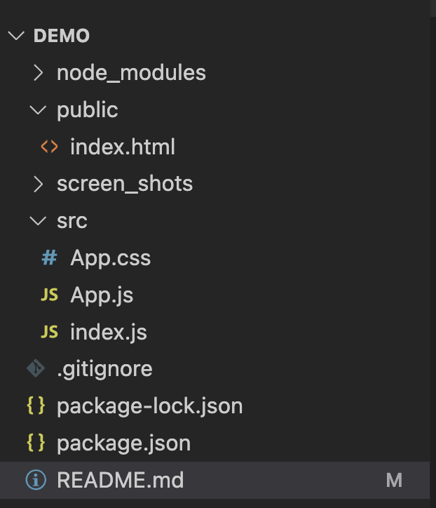
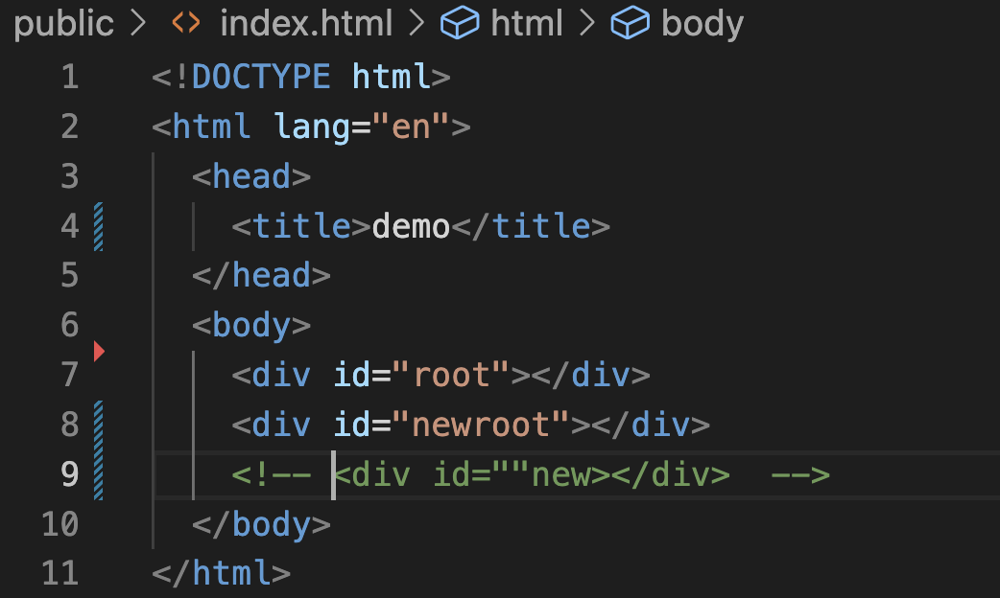
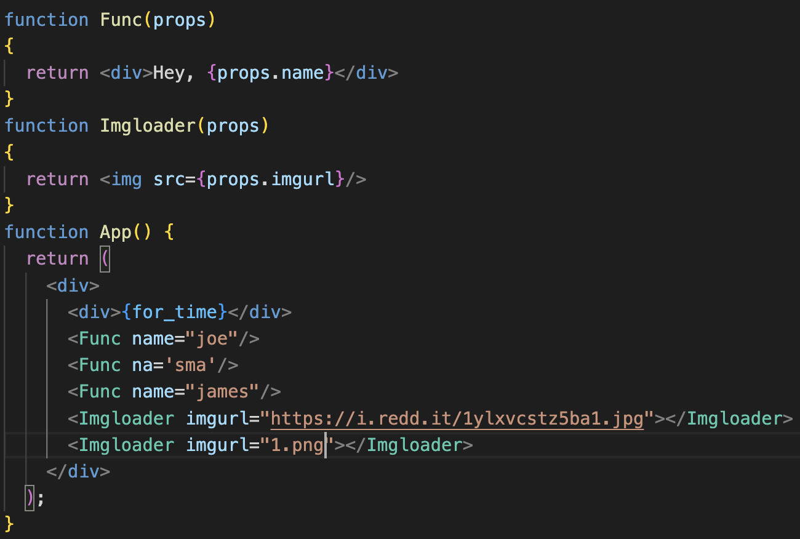
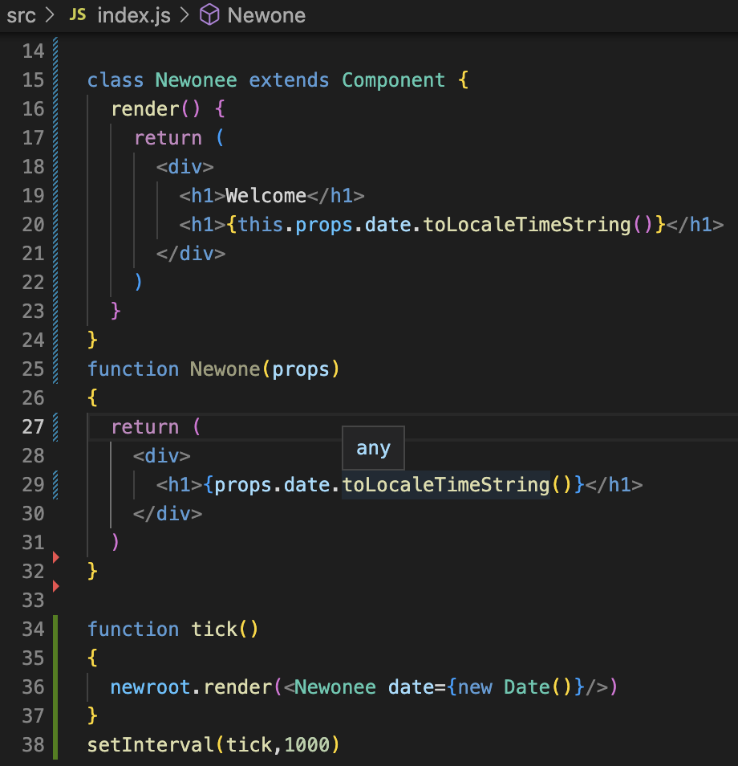
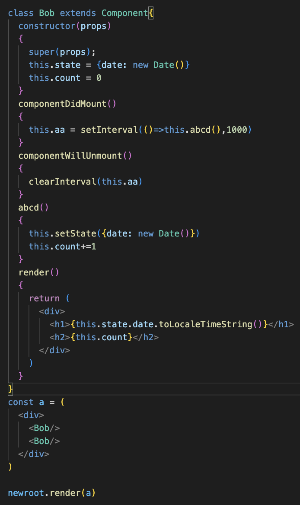

this is react learning thingyy

you can add as many roots as u want:

understand wat components and props , similar to func and paraments

Writing class as a function

<h2>Components -> props and state  Props are passed to components as arguments State is inside the components, it re-render whenever there is a change happens</h2>

rendering changes using state with class

Do not modify state directly: 
correctway: this.state({date: new Date()}) 
incorrect_way: this.state.date = new Date()

<h3>simple counter using setstate:</h3>
