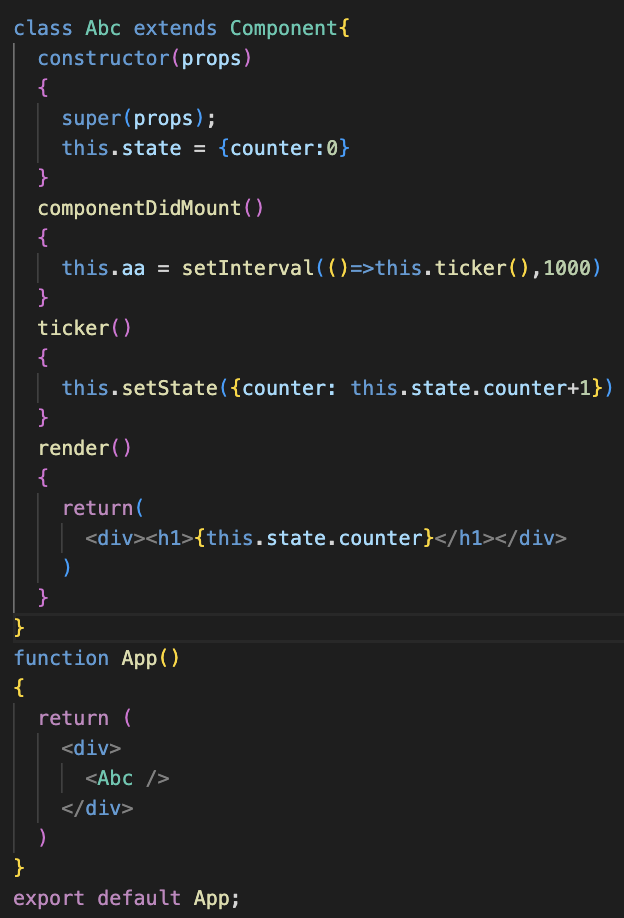
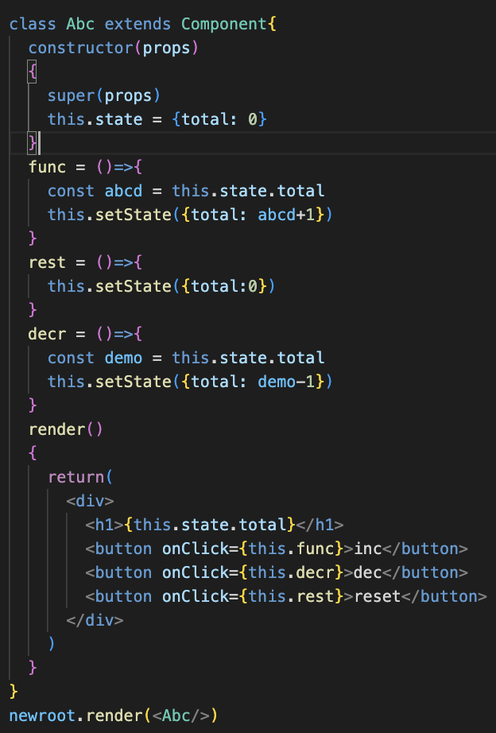

this is react learning thingyy

you can add as many roots as u want:

understand wat components and props , similar to func and paraments

Writing class as a function

<h2>Components -> props and state  Props are passed to components as arguments State is inside the components, it re-render whenever there is a change happens</h2>

rendering changes using state with class

Do not modify state directly: 
correctway: this.state({date: new Date()}) 
incorrect_way: this.state.date = new Date()

<h3>simple counter using setstate:</h3>

<h3>simple counter with inc,dec and reset buttons</h3>

this is correct: 
<pre>decr = ()=>{
    const demo = this.state.total
    this.setState({total: demo-1})
  }</pre> 
  
  this is incorrect, cuz u can't modify useState directly 
  <pre>decr = ()=>{
    this.setState({total: this.state.total-=1})
  }</pre>
  

<h2>passing parameter into button</h2>
<pre>
//here we e,cuz to prevent default. which meaning we dont want to call this function when user req for this page
/*function abcd(e){
    e.preventDefault()
}*/
</pre>

<h3>simple counter using button clock, ***have some doubts***</h3>

<h1>Conditional Rendering:</h1>
<h3>logical && condition</h3>

<h3>if else conditional statement</h3>

